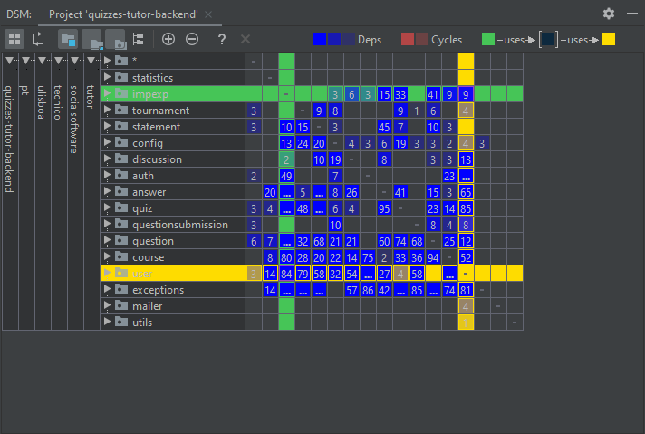

# 1. Dependency Structure Matrix

### How to generate a DSM from IntellJ you need to:
- Make sure you have the Dependency Structure Matrix plugin installed: `> Ctrl+Alt+S > Plugins > Confirm 'Dependency Structure Matrix' under 'Instaled' tab.`
- Generate the matrix: `> RMB in the module > Analyse > Analyse Dependency Matrix > toggle "Whole Project" > Ok` 

### Result for quizzes-tutor-backend:

### How to interpret this DSM (based on the picture):
- The `user` module depends on the `impexp` module with a strength of 84.
- The `impexp` module depends on the `user` module with a strength of 9.
- You can expand each part of the matrix to know exactly, down to method level, where these dependencies are.
