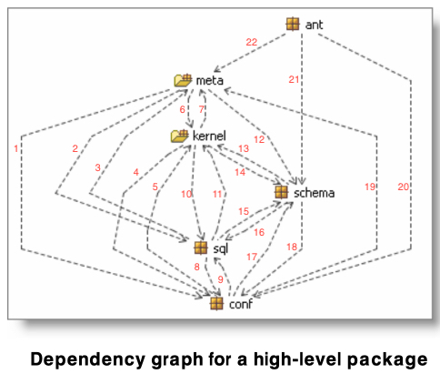
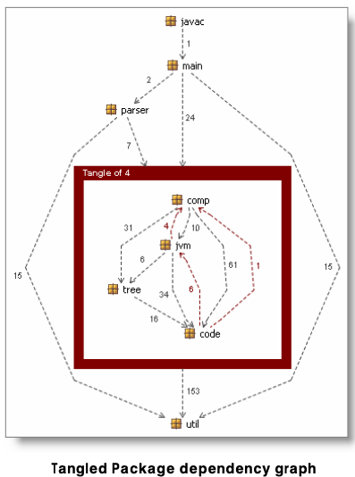
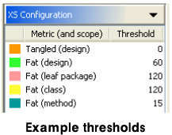

# Measuring complexity in *Structure101*

*Structure101* uses a single metric called *XS* (“excess”) to measure the degree to which an item (package, class, method) exceeds a predefined complexity threshold. An overly complex high-level package will have a higher *XS* than a single method.

2 components of *XS*:
* ***Fat*** - Measures the amount of basic complexity within an item
* ***Tangles*** - Applied to higher-levels (packages, etc) and measures cyclic dependency

## Fat
### Function-level fat
*Structure101* uses *cyclomatic complexity* as the measure of *fat* for subprograms like functions and methods. CC is measured by creating a graph that describes the control flow of the subprogram and then counting the number of possible execution paths.\
*Cyclomatic complexity* is considered a good representation of the intellectual effort required to understand and modify the code.

### Higher-level fat
In the same way a function contains statements, a package may contain classes or other packages.\
In *Structure101* the measure of complexity of these higher-level items is the number of dependencies in the dependency graph of its sub-items.\
In these cases, *Fat* is how much an item exceeds its complexity threshold.

#### Examples
\
This high-level package has a complexity of 22

## Tangles
> A tangle is a set of packages for which there is a path from every package to every other package in the dependency graph.   

Tangles are caused by cyclic dependencies at higher-level items.\
*Structure101* calculates the *minimum feedback set* (MFS) which is the minimum number of dependencies that would have to be removed (highlighted in red in the image above) in order to break up the *tangle* (make the dependency graph acyclic). MFS is calculated using the number of code-level references (next to each edge on the image above).\
The degree of the *tangle* is, thus, the number of dependencies in the MFS divided by the number of dependencies in the whole dependency graph (in the example: 6+4+1 / 386 = 2.8%).

## XS
*XS* is the degree to which an item exceeds its *fat* and/or *tangle* thresholds.

## References
[XS – A Measure of Structural Over-Complexity by Headway Software](https://structure101.com/static-content/pages/resources/documents/XS-MeasurementFramework.pdf)

[Structure101 - Measuring Complexity](https://structure101.com/legacy/measure-complexity/)