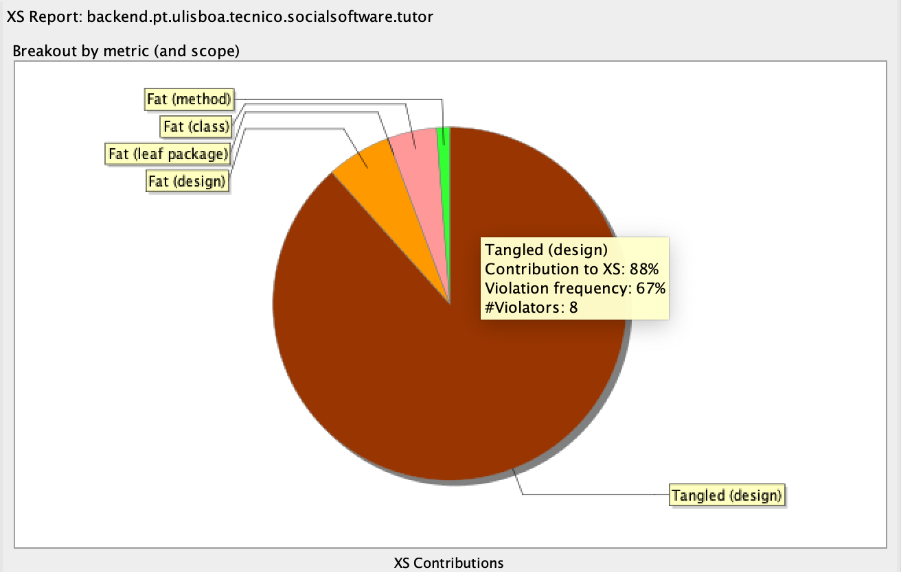
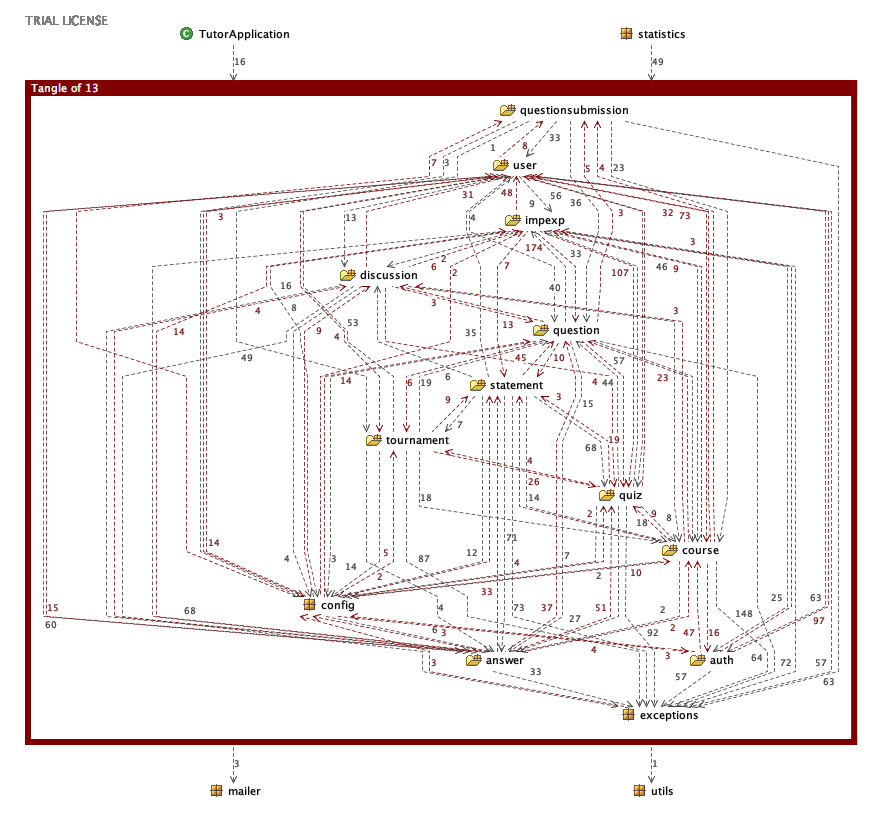
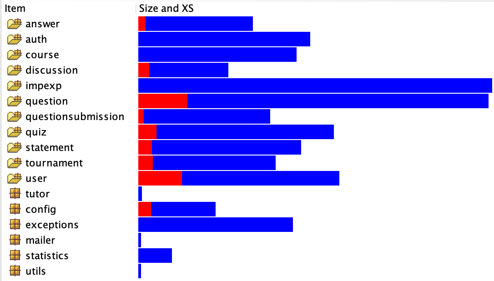
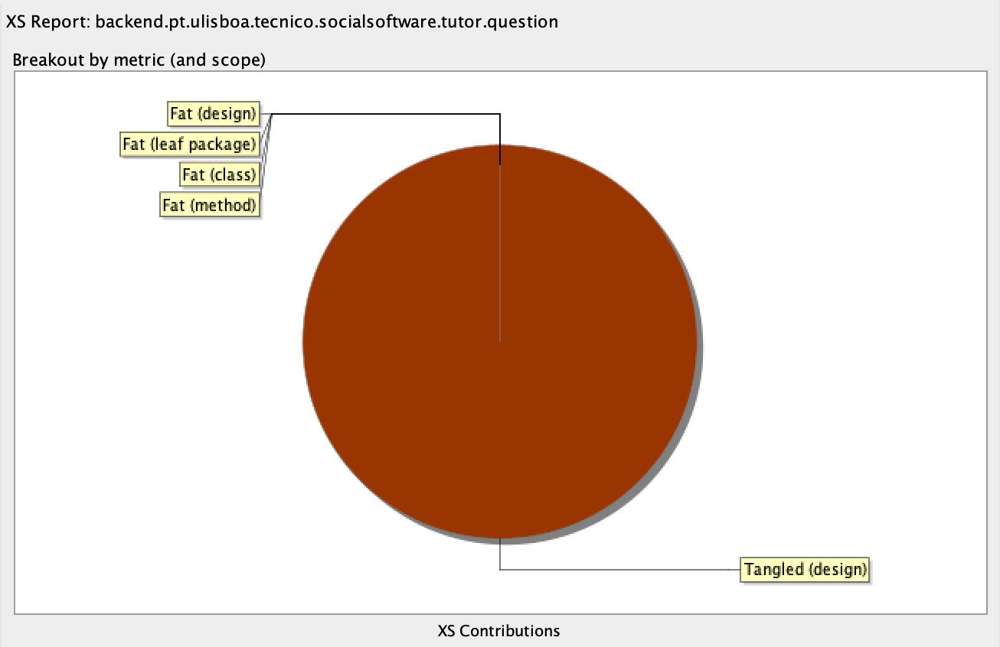
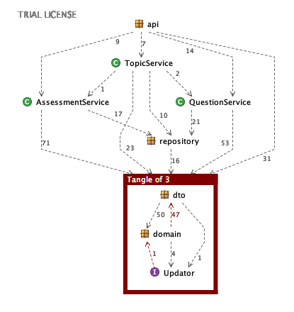
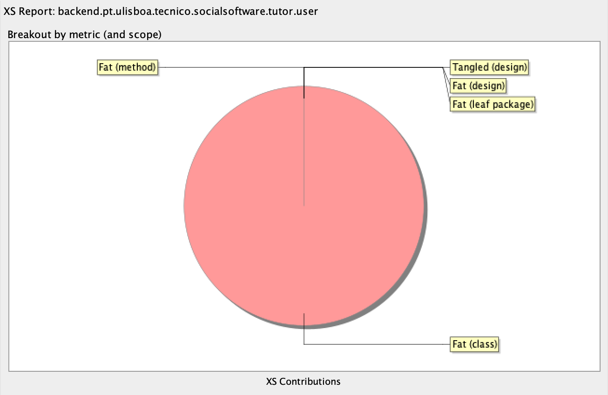

# Using Structure101 to measure complexity in Quizes Tutor

## Overview

### XS Contribution pie chart

Fig 1. XS Contribution Chart for the `backend.pt.ulisboa.tecnico.socialsoftware.tutor` package

*Structure101* shows us that the metric that most contributes to complexity in the Quizes Tutor application is [*tangles*](./how_structure101_measures_complexity.md#Tangles).

---

### Identifying the *minimum feedback set*

Fig 2. *Tangle* of 13 in the `backend.pt.ulisboa.tecnico.socialsoftware.tutor` package

When asked to identify the *tangles*, *Structure101* presents a large one consisting of 13 packages. The [*minimum feedback set*](./how_structure101_measures_complexity.md#Tangles) consists of the dependencies highlighted in red.

---

## Drilldown

Fig 3. *Structure101* size and *XS* drilldown for the `backend.pt.ulisboa.tecnico.socialsoftware.tutor` package

*Structure101* shows us that the packages with the largest *XS* percentage are the `question` and `user` packages.

---
### `question`

Fig4. Complexity contribution chart of the `question` package.

The complexity on this package is exclusively made of *tangles*.
*Structure101* identifies the following tangle inside the package.

\
Fig 5. *Tangle* inside the `question` package

### `user`

The `user` package's complexity, however, is made exclusively of *fat* coming from the `user.domain.User` class.