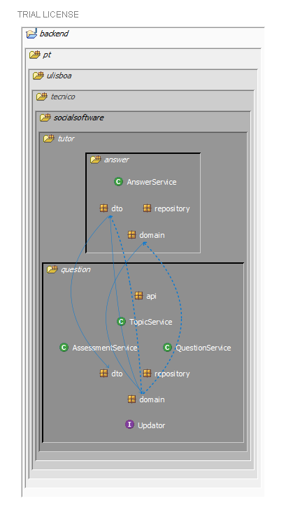
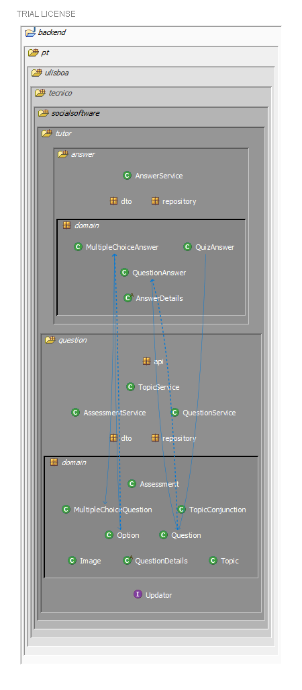
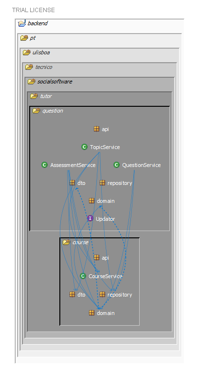
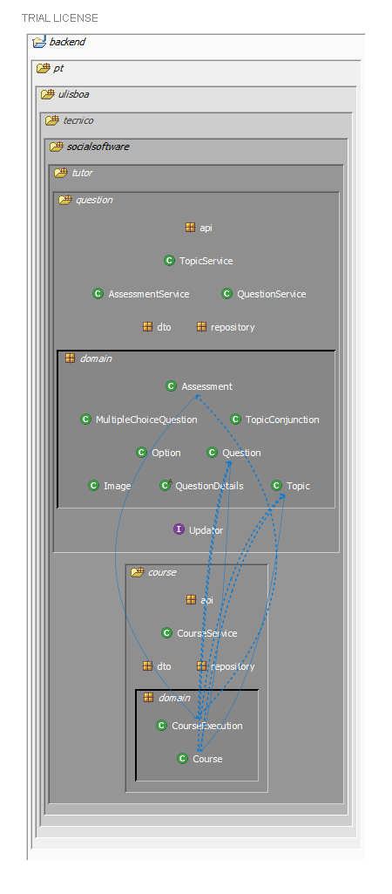

# Relating the captured metric with the suggestions in this SAD
## The `user` package
As stated in the [Quizes Tutor Complexity Analysis](./quizes_tutor_complexity_analysis.md), the `user` module contributes a great deal to the *XS* measurement of the entire `tutor` package and contributes exclusively with *fat*. This means the class is considered "bloated" according to the default *structure101*'s thresholds.

A suggestion in this SAD that would be of help concerning this issue is in the [Uses View's Rationale](../../module_view_uses.md#rationale), specifically *DMI2*, which states
> The user module has a lot of incoming uses dependencies, and therefore, In the future (and a possible solution to migrate quizzes-tutor into a microservices architecture), this module may be turned into an event publisher, publishing events to all the other modules.

This solution would decrease the `user` module (and class) and in turn reduce significantly the project's complexity.

## Cyclic dependencies in the [Uses View](../../module_view_uses.md)

Using *Structure101* it is also easy to spot the cyclic dependencies highlighted in the [Uses View](../../module_view_uses.md). Namely the ones between `question` and `answer` and between `question` and `course`. 
The following images aim to represent these cyclic dependencies between each package and respective `domain` subpackages side by side. The solid arrows represent dependencies and the dotted arrows represent feedback dependencies.

`question` - `answer`         |  `question/domain` - `answer/domain`
:-------------------------:|:-------------------------:
  |  

`question` - `course`         |  `question/domain` - `course/domain`
:-------------------------:|:-------------------------:
  |  